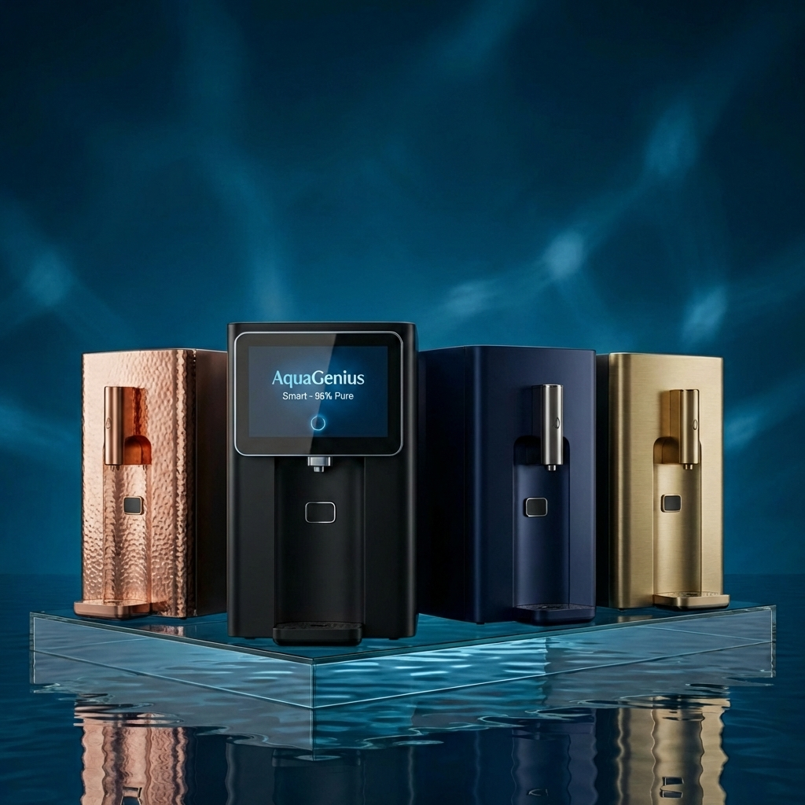

# AquaGenius - Ultra Pure Water

AquaGenius is a premium web application for a Hyderabad-based water purification mission. Built with a focus on **Visual Excellence**, **Performance**, and **User Experience**, the site serves as a digital bridge between advanced industrial filtration and home health.



## 🚀 Quick Start

Get the project running on your local machine in less than a minute:

```bash
# Clone and enter directory
git clone <repository-url>
cd AWebapp

# Install and Run
npm install
npm run dev
```

## 📚 Documentation Hub

For in-depth developer information, please refer to the following guides:

- **[Architecture & Tech Stack](docs/ARCHITECTURE.md)**: Why we chose Next.js 15, React 19, and Tailwind 4. Includes architectural flow diagrams.
- **[Deployment & Setup](docs/DEPLOYMENT.md)**: Detailed steps for local development, Vercel hosting, and environment variable configuration.
- **[Design System (Glossy UI)](docs/DESIGN_SYSTEM.md)**: Understanding our Glassmorphism aesthetic, theme implementation, and component patterns.

## ✨ Core Features

- **Premium Aesthetics**: Heavy use of glassmorphism, smooth animations, and ultra-vibrant imagery.
- **Dual-Theme Engine**: Seamless switching between a Deep Navy "Midnight" mode and a Crisp "Light" mode.
- **WhatsApp Integration**: A global companion bridge for instant customer engagement.
- **Responsive Design**: Optimized for everything from mobile handhelds to 4K monitors.

## 🛠️ Tech Stack

- **Core**: Next.js 15 (App Router), React 19 (Latest hooks).
- **Styling**: Tailwind CSS 4, CSS Modules.
- **Icons**: Lucide React.
- **Type**: TypeScript (100% Type Safety).

---

© 2026 AquaGenius Mission. Redefining family hydration.
