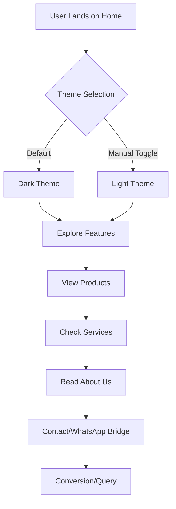

# Architecture & Tech Stack

## Architectural Brief
AquaGenius is built as a highly performant, single-page application (SPA) using **Next.js 15**. It follows a component-based architecture where each section of the page (Hero, Products, About, etc.) is isolated within the `src/components` directory. This ensures high maintainability and scalability.

### Key Patterns:
- **App Router**: Leveraging the latest Next.js 15 routing for better performance and simplified data fetching.
- **Modular CSS**: Using CSS Modules (`*.module.css`) to ensure styles are scoped and avoid global naming collisions.
- **Glassmorphism**: A core design pattern implemented across the UI to create a premium, translucent aesthetic.

## Tech Stack Reasoning

| Technology | Role | Why we chose it |
| :--- | :--- | :--- |
| **Next.js 15** | Framework | Industry standard for React apps; provides excellent SEO, fast bundles, and the robust App Router. |
| **React 19** | UI Library | Benefits from the latest hooks and performance optimizations (like React Compiler compatibility). |
| **Tailwind CSS 4** | Styling | Version 4 offers a more streamlined engine and better integration with modern CSS features. |
| **TypeScript** | Language | Ensures type safety across the board, reducing runtime errors and improving developer DX. |
| **Lucide React** | Icons | Lightweight, consistent, and highly customizable icon set. |

## User Flow Diagram

## Data Flow
The application currently operates as a static-heavy site with interactive client components for local state (like theme switching and carousels).

1. **Static Content**: Sections like "About" and "Services" are optimized for fast initial load.
2. **Interactive Components**: The `ThemeContext` manages the global theme state, injecting classes into the `<body>` for CSS variable switching.
3. **External Bridges**: Direct integration with WhatsApp via URL schemes for immediate customer engagement.
